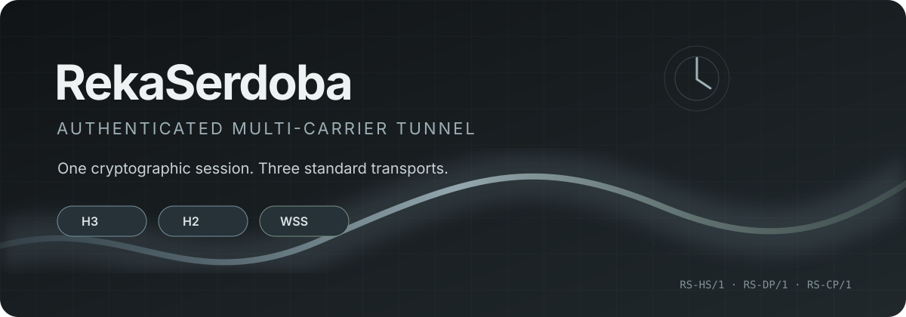
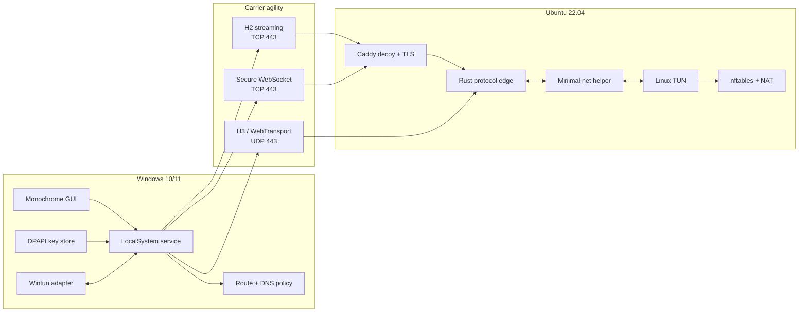
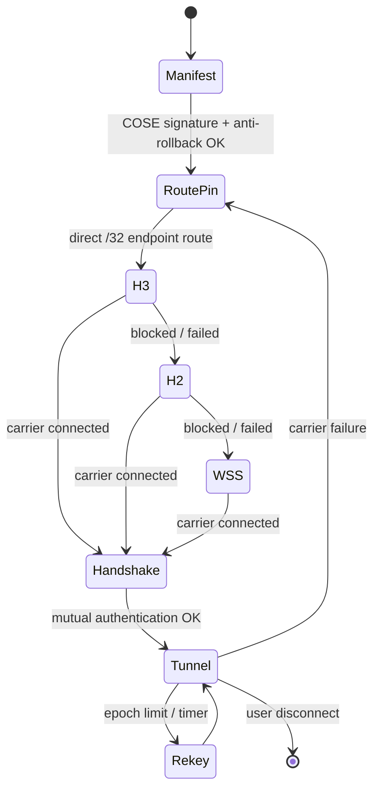
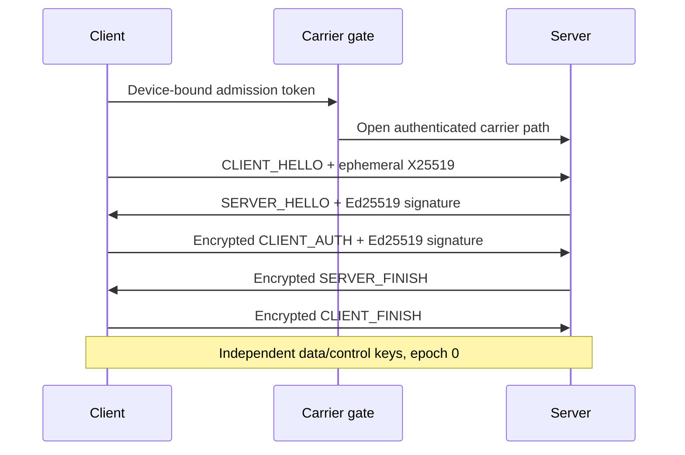

<div align="center">
  

  <p>
    <strong>Собственный исследовательский VPN-протокол с настоящими H3, H2 и WSS carriers.</strong><br>
    Один криптографический сеанс, несколько стандартных транспортов и безопасное переключение между ними.
  </p>

  <p>
    <a href="https://github.com/kristexIO/RekaSerdoba/actions/workflows/ci.yml"></a>
    <a href="LICENSE"></a>
    
    
    
  </p>

  <p>
    <a href="#-чем-rekaserdoba-отличается">Особенности</a> ·
    <a href="#-архитектура">Архитектура</a> ·
    <a href="#-быстрый-старт-для-разработчика">Быстрый старт</a> ·
    <a href="RekaSerdoba_protocol_ru.md">Спецификация</a> ·
    <a href="https://messk.online">Reference frontend</a>
  </p>
</div>

> [!WARNING]
> RekaSerdoba — research software. Код покрыт тестами и работает в reference deployment, но ещё не прошёл независимый криптографический аудит, длительный fuzz/chaos soak и формальную верификацию. Не используйте его для критичных данных.

## Что это

RekaSerdoba — не оболочка над WireGuard, OpenVPN или Shadowsocks. Проект определяет собственные:

- взаимно аутентифицированный handshake `RS-HS/1`;
- encrypted data plane `RS-DP/1`;
- control plane `RS-CP/1`;
- key schedule, packet counters и anti-replay windows;
- routine key update и полный signed ephemeral rekey;
- carrier migration и подписанный manifest.

При этом криптографические примитивы намеренно стандартные: X25519, Ed25519, HKDF-SHA-256 и ChaCha20-Poly1305. Изобретать собственную кривую или AEAD было бы не преимуществом, а риском.

## Почему такое название

Сердоба — река. Протокол устроен похожим образом: защищённый поток может менять русло между H3, H2 и WSS, сохраняя криптографическую идентичность и состояние сессии.

## ✦ Чем RekaSerdoba отличается

| Особенность | Что это даёт |
|---|---|
| **Три настоящих carrier-а** | WebTransport/HTTP/3 на UDP/443, streaming HTTP/2 и стандартный Secure WebSocket |
| **Один inner-протокол** | Handshake, ключи и anti-replay не зависят от внешнего транспорта |
| **Двухуровневый rekey** | Быстрое симметричное обновление ключей и полный X25519 rekey с Ed25519-подписями |
| **Signed manifest** | Детерминированный CBOR/COSE_Sign1 manifest с offline authority и rollback protection |
| **Device admission** | Дешёвый gate отсекает случайный трафик до дорогой криптографии, но не заменяет client authentication |
| **Privilege separation** | Linux edge не открывает `/dev/net/tun`; минимальный helper передаёт только IP-пакеты через Unix socket |
| **Crash-safe Windows routing** | Endpoint route фиксируется до carrier connect, а tunnel routes снимаются при остановке или сбое |
| **Machine-bound secrets** | Windows device bundle хранится через machine-scope DPAPI |
| **Обычный web frontend** | TCP/443 обслуживает нормальный H1/H2-сайт, UDP/443 — тот же origin через H3/WebTransport |

## ◈ Архитектура



### Состояние подключения



### Handshake в пяти сообщениях



## Реализация на сегодня

```text
Carriers                 ████████████████████  3 / 3
Rust protocol tests      ████████████████████  23 passing
Windows client tests     ████████████████████  11 passing
External crypto audit    ░░░░░░░░░░░░░░░░░░░░  pending
24h fuzz / chaos soak    ░░░░░░░░░░░░░░░░░░░░  pending
```

Цифры выше описывают текущий test suite, а не результаты независимого аудита или benchmark.

## Структура репозитория

```text
.
├── rekaserdoba/             Rust server, H3 bridge and protocol tools
│   ├── src/
│   ├── tools/
│   └── tests/vectors/
├── windows-client/          Windows service, GUI, installer sources
├── deploy/                  systemd, Caddy, nftables and hardening
├── docs/                    Architecture and deployment notes
├── examples/                Redacted configuration templates
└── RekaSerdoba_protocol_ru.md
```

Боевые client bundles, private keys, server backups и готовые персонализированные установщики намеренно не публикуются.

## Быстрый старт для разработчика

### Rust server

```bash
cd rekaserdoba
cargo fmt --check
cargo test --locked
cargo build --locked --release
```

### Protocol tools

```bash
python3 -m venv .venv
source .venv/bin/activate
pip install -r rekaserdoba/tools/requirements.txt
PYTHONPATH=rekaserdoba/tools python -m unittest discover -s rekaserdoba/tools -p "test_*.py"
```

### Windows client tests

```powershell
python -m pip install cryptography==49.0.0 h2==4.3.0
$env:PYTHONPATH="$PWD\windows-client;$PWD"
python -m unittest -v windows-client\test_client.py
```

### Персонализированная Windows-сборка

Для installer нужны ваш device bundle, официальный `wintun.dll` и собранный `h3_bridge.exe`. Bundle содержит секреты и никогда не должен попадать в Git.

```powershell
.\windows-client\build.ps1 `
  -Bundle C:\secure\client-bundle.json `
  -Python C:\Python312\python.exe
```

Полный порядок развёртывания описан в [docs/DEPLOYMENT.md](docs/DEPLOYMENT.md).

## Криптографические границы

| Слой | Механизм |
|---|---|
| Ephemeral key agreement | X25519 |
| Long-term identity | Ed25519 |
| Key derivation | HKDF-SHA-256 |
| Record encryption | ChaCha20-Poly1305 |
| Manifest signing | COSE_Sign1 / Ed25519 |
| Replay defense | Per-direction, per-epoch sliding windows |
| Secret storage on Windows | Machine-scope DPAPI |

Gate credential — только capability для входа в handshake path. Клиента аутентифицирует Ed25519-подпись внутри encrypted handshake.

## Ограничения

- проект пока IPv4-only;
- production release требует собственного key ceremony и per-device bundles;
- automated 0-RTT/resumption отключены;
- нет независимого security audit;
- H3 использует надёжный WebTransport stream ради стабильности; optional datagram mode остаётся предметом дальнейших исследований;
- GUI и installer ориентированы на Windows 10/11 x64.

## Документация

- [Полная спецификация протокола](RekaSerdoba_protocol_ru.md)
- [Архитектурные решения](docs/ARCHITECTURE.md)
- [Развёртывание](docs/DEPLOYMENT.md)
- [Политика безопасности](SECURITY.md)
- [Windows-клиент](windows-client/README_RU.md)

## Лицензия

Проект распространяется по лицензии [MIT](LICENSE).

Это означает, что код можно свободно использовать, копировать, изменять, объединять, публиковать, распространять, сублицензировать и продавать. Условия всего два: сохранить copyright notice и текст лицензии. Программное обеспечение предоставляется «как есть», без гарантий.

---

<div align="center">
  <sub>Built by <a href="https://github.com/kristexIO">kristexIO</a> · MIT · 2026</sub>
</div>
