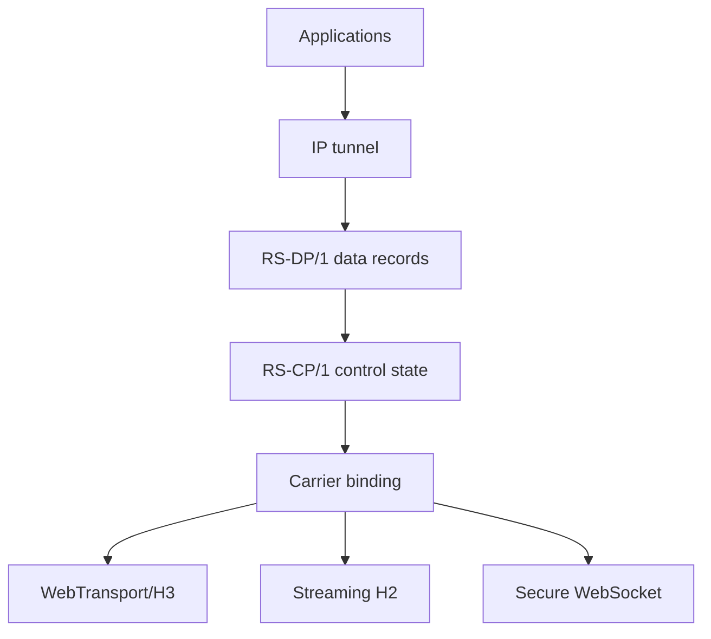
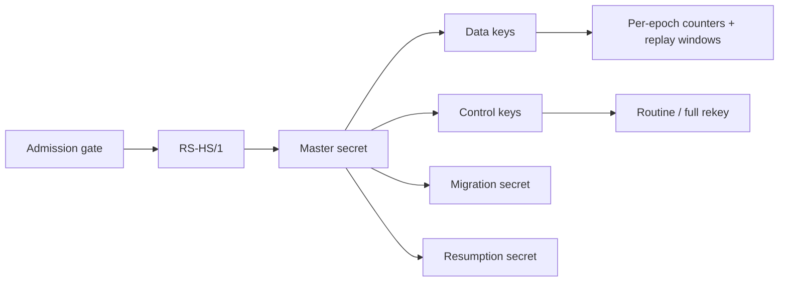

# Architecture

## Design goal

RekaSerdoba separates the authenticated encrypted session from the carrier that transports its records. H3, H2 and WSS therefore share one inner handshake, key schedule, replay policy and identity model.

## Trust boundaries

### Windows

- The service runs as `LocalSystem`.
- The device bundle is encrypted with machine-scope DPAPI.
- The endpoint `/32` route is installed before opening a carrier.
- Full tunnel routes are activated only after the authenticated handshake succeeds.
- Recovery removes routes when a carrier fails, the service stops or installation is rolled back.
- The GUI controls the service but does not own protocol secrets.

### Linux

- `rekaserdoba-server` owns protocol and session state but does not open `/dev/net/tun`.
- `rekaserdoba-net-helper` owns the TUN interface and exchanges only IP packets through Unix datagram sockets.
- Runtime capabilities are dropped after initialization.
- Caddy terminates normal TCP TLS and serves the decoy website.
- The Rust H3 edge terminates QUIC/TLS on UDP/443 using the synchronized WebPKI certificate.

## Cryptographic layers

The admission gate is intentionally not authentication. It limits access to the expensive handshake path. Client authentication is provided by the Ed25519 signature in encrypted `CLIENT_AUTH`.

## Carrier behavior

| Carrier | Outer protocol | Delivery | Typical role |
|---|---|---|---|
| H3 | WebTransport over QUIC/TLS | Reliable bidirectional stream | Preferred path |
| H2 | Streaming request/response over TLS | Reliable ordered stream | UDP-blocked fallback |
| WSS | Standard WebSocket over TLS | Reliable messages | Compatibility fallback |

The H3 implementation retains receiver compatibility for QUIC datagrams, but the stable sender uses a reliable WebTransport stream to avoid incomplete IP-fragment assemblies under packet loss.

## Session lifecycle

1. Fetch and verify the COSE-signed manifest.
2. Reject manifest sequence rollback.
3. Pin the server endpoint route to the physical interface.
4. Open the selected carrier.
5. Complete mutual authentication.
6. Activate the tunnel route and DNS policy.
7. Pump IP packets while enforcing replay, quota and lifetime limits.
8. Rekey or migrate when required.
9. Remove network policy on disconnect or failure.

## Explicit non-goals

- Inventing custom cryptographic primitives.
- Claiming invisibility from every DPI implementation.
- Treating a decoy website as cryptographic security.
- Shipping shared production credentials in public releases.
